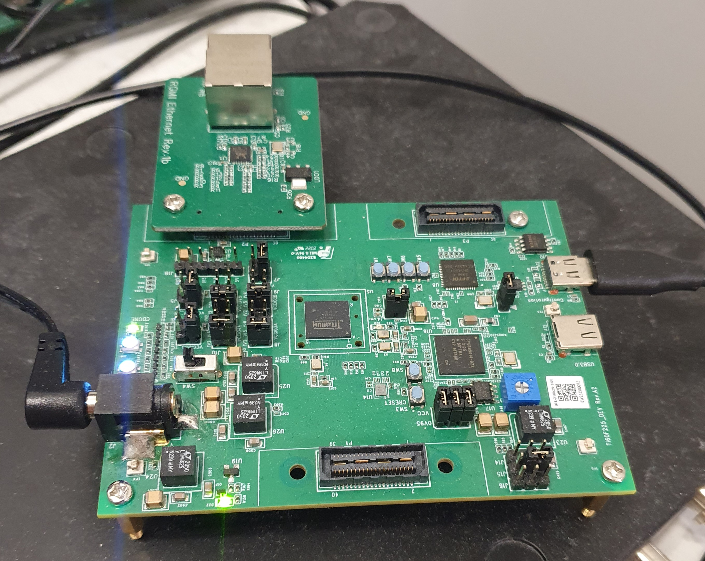
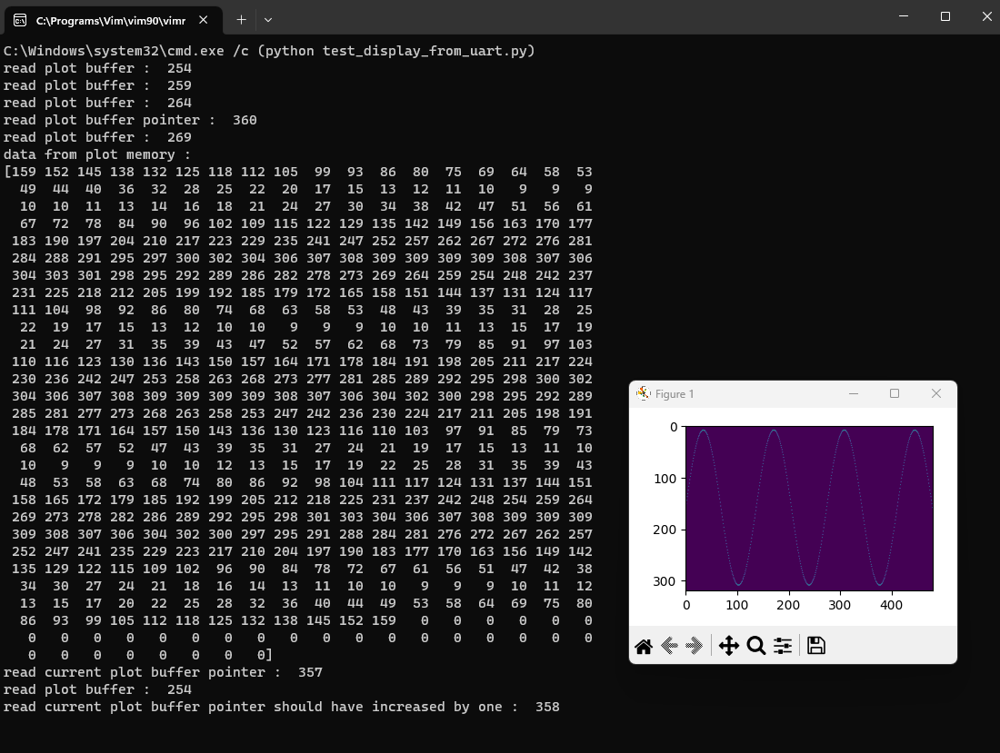

# test_lcd_screen_driver
a test project targeting efinix titanium to drive a tft lcd screen
The design of the pixel image plotter is documented in a blog post

https://hardwaredescriptions.com/pixel-image-from-vhdl-part-1/

  </a>

Currently has build for both the efinix titanium evaluation kit as well as a custom board built with the lcd spi pin header.

clone with submodules using
git clone --recurse-submodules -j8 https://github.com/johonkanen/test_fpga_lcd_screen_driver.git

open efinity ide 2022.2 or newer and build and load the .bit file to the board.

running the test_display_from_uart.py results in ram printed to console as well as a pixel image plotted using pyplot

  </a>

